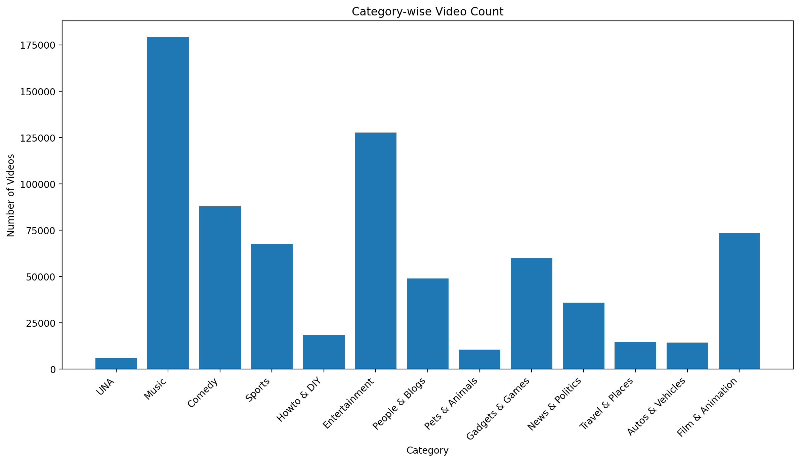
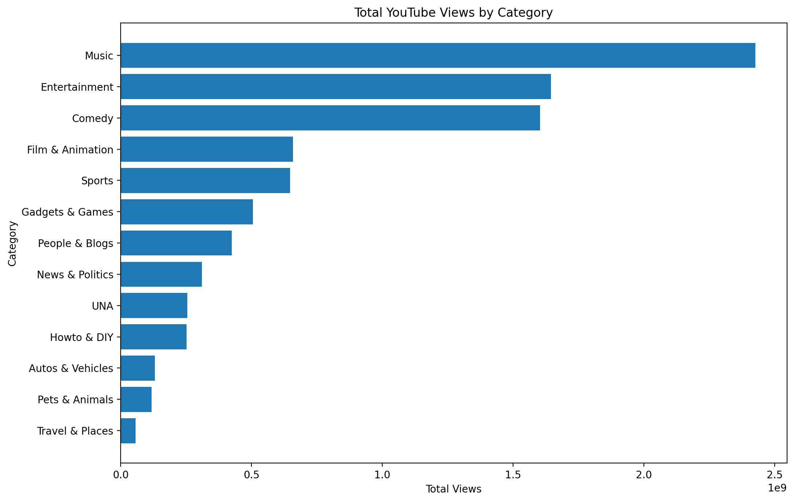
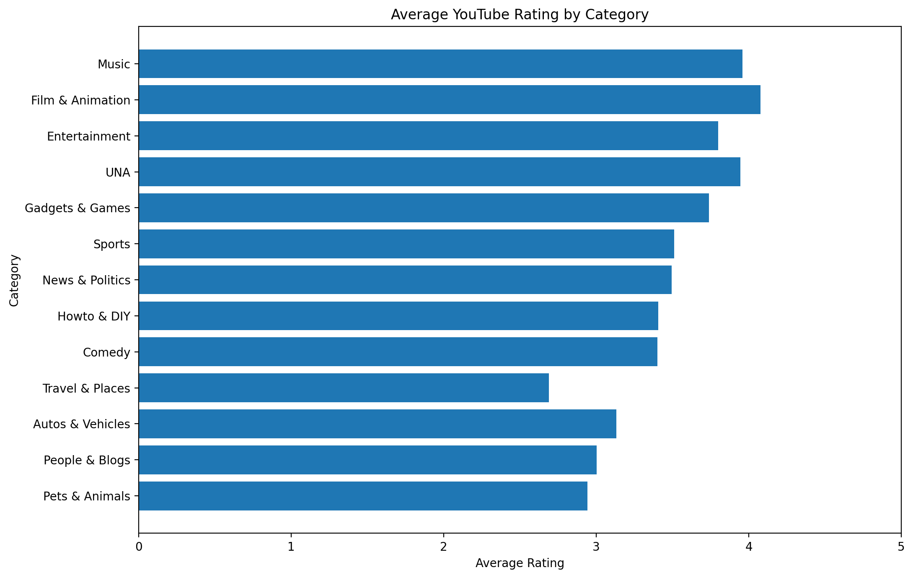

# Big Data Analytics Final Project

## YouTube Video Data Analysis using Hadoop HDFS, MapReduce and Apache Pig

A Big Data Analytics project that processes and analyzes **749,361 YouTube video records** using **Hadoop HDFS, Java MapReduce, and Apache Pig**. The project performs category-level analysis of video count, total views, and average ratings, and compares the results produced by MapReduce and Pig.

---

## 1. Project Objectives

The main objectives of this project are:

- Store a large YouTube dataset in **Hadoop Distributed File System (HDFS)**.
- Demonstrate distributed data storage and block management.
- Process the dataset using **Java MapReduce**.
- Perform equivalent analysis using **Apache Pig**.
- Compare MapReduce and Pig results.
- Generate clear visualizations for the analytical results.
- Demonstrate a complete Big Data processing workflow from raw data to insights.

---

## 2. Dataset

The dataset contains **749,361 YouTube video records** distributed across five input files.

### Main attributes

| Field | Description |
|---|---|
| `video_id` | Unique video identifier |
| `uploader` | Video uploader |
| `age` | Age-related dataset field |
| `category` | YouTube video category |
| `length` | Video length |
| `views` | Number of views |
| `rate` | Average video rating |
| `ratings` | Number of ratings |
| `comments` | Number of comments |
| Related IDs | Related YouTube video identifiers |

The raw dataset is **not included in this repository** because of its large size.

---

## 3. System Architecture / Workflow

```text
                 YouTube Dataset
                       |
                       v
              +------------------+
              |       HDFS       |
              | Distributed Data |
              |     Storage      |
              +------------------+
                       |
             +---------+---------+
             |                   |
             v                   v
      +-------------+     +-------------+
      |  MapReduce  |     |     Pig     |
      | Java Jobs   |     |  Scripts    |
      +-------------+     +-------------+
             |                   |
             +---------+---------+
                       |
                       v
              +------------------+
              | Aggregated       |
              | Analytical       |
              | Results          |
              +------------------+
                       |
                       v
              +------------------+
              | Visualizations   |
              +------------------+
```

### Processing Flow

1. The YouTube dataset is stored locally.
2. Dataset files are uploaded to HDFS.
3. HDFS divides the data into blocks and manages distributed storage.
4. MapReduce performs category-based analytical operations.
5. Apache Pig performs equivalent analytical operations.
6. Results from both approaches are compared.
7. The final results are presented using visualizations.

---

## 4. HDFS Implementation

The dataset was uploaded to:

```text
/bda_final_project/input
```

The HDFS verification showed:

- **749,361 input records**
- **6 HDFS blocks**
- **Replication factor: 1**
- **0 missing blocks**
- **0 corrupt blocks**
- **0 under-replicated blocks**

HDFS command evidence is available in:

```text
hdfs/commands.txt
```

Screenshots are available in:

```text
screenshots/hdfs/
```

---

## 5. MapReduce Analysis

Three Java MapReduce programs were implemented.

### 5.1 Category Video Count

Counts the number of videos in each category.

**Highest category:** Music — **179,049 videos**

### 5.2 Category Total Views

Calculates the total number of views for each category.

**Highest category:** Music — **2,426,199,511 views**

### 5.3 Category Average Rating

Calculates the average rating for each category.

**Highest category:** Film & Animation — **approximately 4.08**

### MapReduce Source Files

```text
mapreduce/src/
├── CategoryCount.java
├── CategoryTotalViews.java
└── CategoryAverageRating.java
```

Compiled JAR files are also included in the `mapreduce/` directory.

MapReduce result screenshots:

```text
screenshots/mapreduce/
```

---

## 6. Apache Pig Analysis

The same analytical tasks were implemented using Apache Pig.

### Pig Scripts

```text
pig/
├── load_data.pig
├── count_data.pig
├── category_count.pig
├── category_total_views.pig
└── category_average_rating.pig
```

The Pig implementation performs:

- Total record counting
- Category-wise video counting
- Category-wise total view calculation
- Category-wise average rating calculation

Pig result screenshots are available in:

```text
screenshots/pig/
```

---

## 7. MapReduce vs Apache Pig

| Feature | MapReduce | Apache Pig |
|---|---|---|
| Programming style | Java programming | Pig Latin |
| Complexity | More code and logic required | Simpler and shorter |
| Data processing | Mapper and Reducer | Pig relational operators |
| Development speed | Comparatively slower | Faster |
| Flexibility | High | High for data-flow analysis |
| Ease of use | More difficult | Easier |
| Result | Same analytical results | Same analytical results |

For this project, **Pig required less code for the analytical queries**, while MapReduce provided more explicit control over the mapper and reducer processing logic.

---

## 8. Results and Key Findings

### Video Count

| Category | Video Count |
|---|---:|
| Music | 179,049 |
| Entertainment | 127,674 |
| Comedy | 87,818 |
| Film & Animation | 73,293 |
| Sports | 67,329 |

**Finding:** Music contains the largest number of videos in the dataset.

### Total Views

| Category | Total Views |
|---|---:|
| Music | 2,426,199,511 |
| Entertainment | 1,644,510,629 |
| Comedy | 1,603,337,065 |
| Autos & Vehicles | 131,705,784 |
| Sports | 647,412,772 |

**Finding:** Music has the highest total number of views.

### Average Rating

| Category | Average Rating |
|---|---:|
| Film & Animation | 4.0777 |
| Entertainment | 3.7990 |
| Gadgets & Games | 3.7384 |
| Sports | 3.5107 |
| Music | 3.9583 |

**Finding:** Film & Animation has the highest average rating at approximately **4.08**.

---

## 9. Visualizations

The project includes three result visualizations:

### Category-wise Video Count



### Category-wise Total Views



### Category-wise Average Rating



---

## 10. Project Structure

```text
BDAL_Final_Project/
│
├── hdfs/
│   └── commands.txt
│
├── mapreduce/
│   ├── src/
│   │   ├── CategoryCount.java
│   │   ├── CategoryTotalViews.java
│   │   └── CategoryAverageRating.java
│   ├── CategoryCount.jar
│   ├── CategoryTotalViews.jar
│   └── CategoryAverageRating.jar
│
├── pig/
│   ├── load_data.pig
│   ├── count_data.pig
│   ├── category_count.pig
│   ├── category_total_views.pig
│   └── category_average_rating.pig
│
├── screenshots/
│   ├── hdfs/
│   ├── mapreduce/
│   ├── pig/
│   └── visualizations/
│
├── docs/
├── .gitignore
└── README.md
```

---

## 11. How to Run

### Start Hadoop

Make sure Hadoop HDFS and YARN services are running.

Verify with:

```bash
jps
```

### Create the HDFS input directory

```bash
hdfs dfs -mkdir -p /bda_final_project/input
```

### Upload dataset

```bash
hdfs dfs -put <dataset-files> /bda_final_project/input/
```

### Verify HDFS

```bash
hdfs dfs -ls /bda_final_project/input
hdfs fsck /bda_final_project/input -files -blocks -locations
```

### Run MapReduce

Example:

```bash
hadoop jar CategoryCount.jar CategoryCount /bda_final_project/input /bda_final_project/output
```

The other MapReduce JARs can be executed similarly with different output directories.

### Run Pig

Example:

```bash
pig category_count.pig
```

The remaining Pig scripts can be executed in the same way.

---

## 12. Limitations

- The raw dataset is not stored in the GitHub repository because of its size.
- The Hadoop environment is demonstrated using a local pseudo-distributed setup.
- The analysis is primarily category-based.
- The project does not include real-time streaming analysis.

---

## 13. Future Improvements

Possible future improvements include:

- Add Hive-based analysis.
- Add Spark-based processing.
- Implement more advanced statistical analysis.
- Analyze relationships between views, ratings, comments, and video length.
- Build an interactive dashboard.
- Use a multi-node Hadoop cluster for larger-scale distributed processing.
- Add automated performance benchmarking between MapReduce, Pig, and Spark.

---

## 14. Conclusion

This project demonstrates a complete Big Data Analytics workflow using **HDFS, Java MapReduce, and Apache Pig**. The dataset containing **749,361 YouTube records** was successfully stored and processed, and equivalent analytical results were obtained using both MapReduce and Pig.

The analysis shows that **Music** has the highest number of videos and the highest total views, while **Film & Animation** has the highest average rating. The project also demonstrates how higher-level tools such as Pig can simplify data-flow analysis compared with implementing the same operations directly in Java MapReduce.

---

## Repository

**GitHub:** https://github.com/Imtiaz-1132/BDAL_Final_Project
